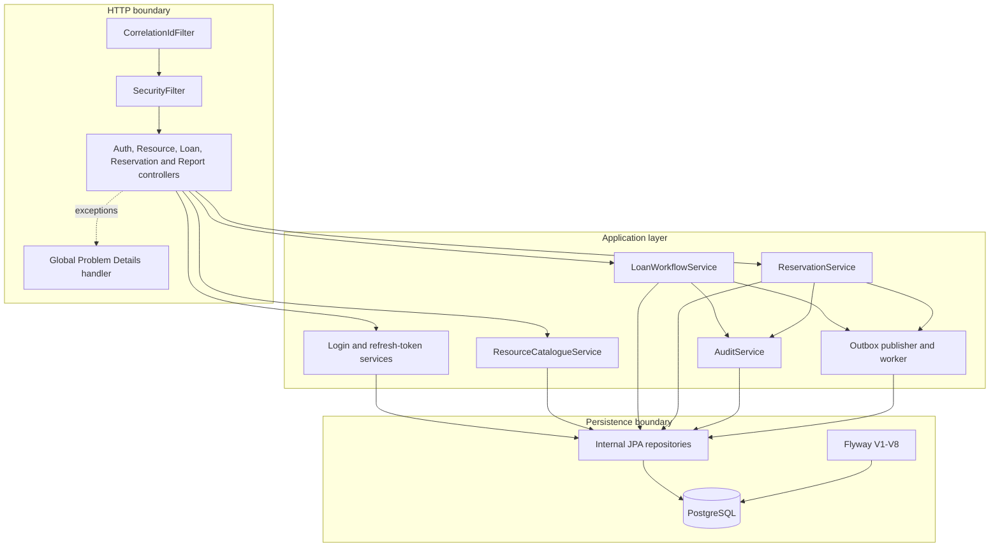
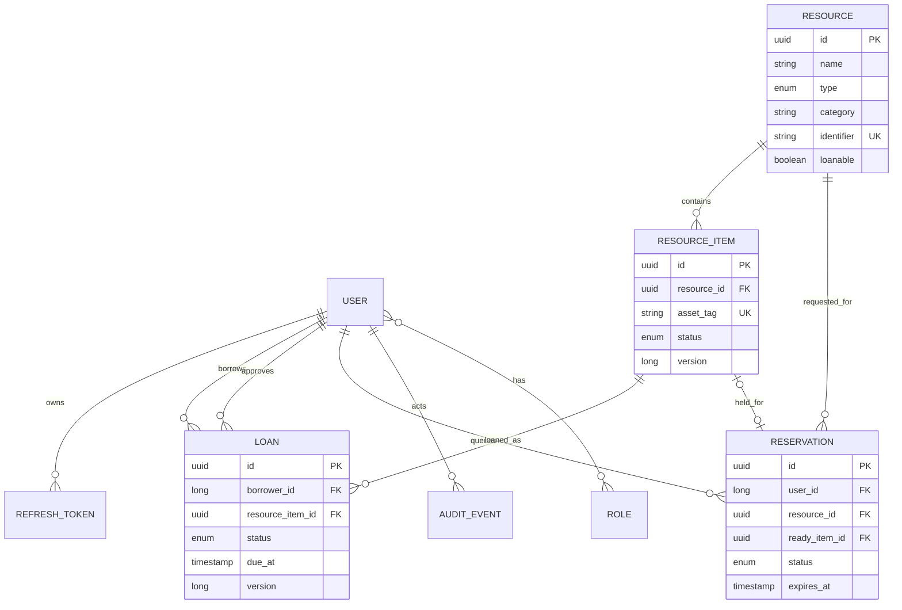
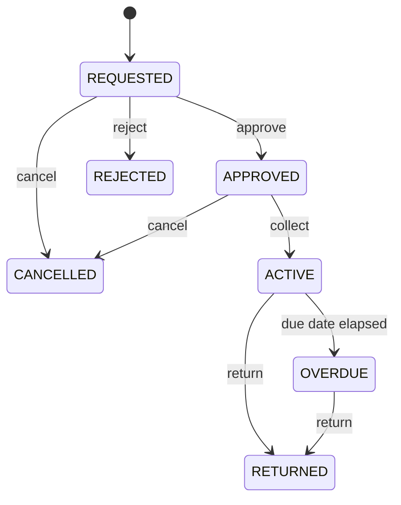
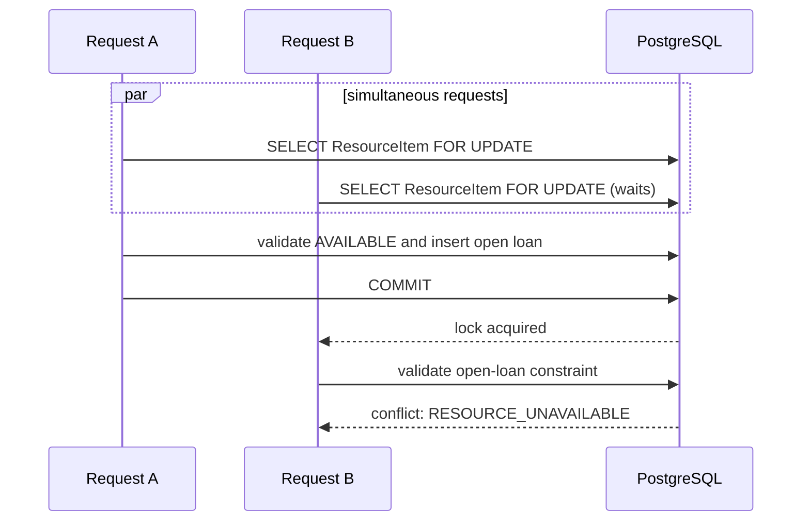
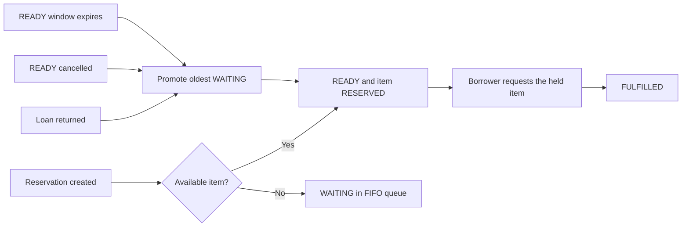

# Architecture and domain flows

This document describes the implemented system. It deliberately excludes roadmap ideas and uses the same names and states exposed by the code and OpenAPI contract.

## Component boundaries

The modules form one deployable process and one transactional database. This keeps consistency rules simple while feature packages and structural tests prevent the codebase from collapsing into controller-to-repository CRUD.

## Logical domain model

`Resource` is the catalogue description; `ResourceItem` is the physical unit that can be reserved or loaned. That distinction allows two laptops of the same model to carry different asset tags and lifecycle states.

Loan policies are reference data keyed by role and resource type. Audit events reference domain entities by type and UUID so the audit store does not participate in their lifecycle.

## Loan state machine

The service validates the expected source state inside the same transaction that writes the target state and audit event. Due dates are assigned on collection from the matching role/resource policy. A borrower with an overdue loan or a reached active-loan limit cannot open another loan.

## Last-item concurrency

The application uses a pessimistic write lock while selecting the item. PostgreSQL partial unique index `uk_loans_item_open` is a second line of defence: at most one `REQUESTED`, `APPROVED`, `ACTIVE` or `OVERDUE` loan can reference an item. The integration suite starts two threads against the same item and asserts exactly one succeeds.

## Reservation promotion

Open reservations are unique per user/resource. A scheduled scanner expires missed pickup windows; cancellation, expiry and return all reuse the same promotion logic.

## Security and token lifecycle

Access tokens are signed JWTs with a 15-minute lifetime. Refresh tokens are 48-byte opaque values; only their SHA-256 hashes are persisted. Rotation locks the database row, revokes the presented token and issues a replacement. Reusing a revoked token revokes every active refresh token for that user.

URL rules provide early rejection, while method security and ownership checks protect service calls even when they are not reached through the expected controller.

## Schema evolution

Flyway owns the schema and Hibernate only validates it. Migrations are append-only:

1. original schema and identity tables;
2. roles, ownership and refresh tokens;
3. resources and physical items;
4. loans, policies and audit events;
5. reservations and concurrency constraints;
6. retirement of the superseded library model;
7. transactional Outbox and idempotent notification delivery;
8. persistent command idempotency and exact response replay.

V6 moves the original academic tables to PostgreSQL schema `legacy`. This preserves data and migration traceability while keeping the active `public` schema aligned with the current API.

## Operational model

- Structured ECS logs carry `correlationId`, `traceId` and `spanId` without tokens or passwords.
- HTTP requests, repositories, report queries and scheduled jobs emit OpenTelemetry spans over OTLP.
- `/actuator/health` and probe groups are public for orchestrators.
- metrics, Prometheus and info endpoints require `ADMIN` during normal runs. Compose enables a separate loopback-only management chain so its internal Prometheus can scrape health and metrics.
- Domain counters, gauges and histograms describe loan requests, overdue loans, reservation wait and workflow conflicts.
- the final image contains only the runtime and application artifact and runs as user `app`.
- Compose health checks gate API startup on PostgreSQL readiness and provisions Prometheus, Grafana and Jaeger.
