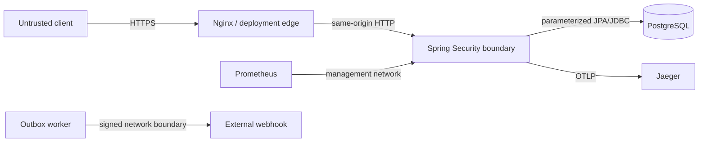

# Threat model

## Scope and security objectives

This model covers the browser console, Nginx proxy, REST API, PostgreSQL database, notification webhook and local observability stack. It protects account credentials and tokens, user identity, inventory availability, loan/reservation integrity, operational reports and audit/outbox history.

The primary objectives are:

1. prevent unauthorized reading or mutation of another user's lending data;
2. preserve the loan state machine and last-item concurrency guarantees;
3. contain credential stuffing, replay and duplicate-command risks;
4. avoid exposing credentials, tokens or personal data through logs and telemetry;
5. retain enough evidence to investigate operational and security incidents.

## Trust boundaries

TLS termination and public network policy belong to the deployment edge. The Compose observability ports bind to loopback and are not a production exposure model.

## STRIDE analysis

| Threat | Example | Implemented control | Residual risk / next control |
|---|---|---|---|
| Spoofing | Credential stuffing or forged JWT | BCrypt, progressive account lock, IP/user rate limits, issuer/signature/expiry validation, `kid` key ring | In-memory limits are per replica; use a shared gateway/Redis limiter at scale and add MFA for privileged users |
| Tampering | Client skips a loan transition or modifies another user's borrower ID | Method authorization, ownership checks, explicit state machine, database constraints and row locks | Privileged staff misuse requires review of immutable audit events |
| Repudiation | User denies a command | Correlation/trace IDs, audit events, Outbox history and idempotency records | Define production retention and restricted audit-reader roles |
| Information disclosure | Tokens in logs, cross-origin theft, observability exposure | Redacted DTO logging, hashed refresh/identity tokens at rest, narrow CORS, CSP/referrer/permissions headers, loopback management ports | Outbox payload temporarily contains one-time delivery tokens; restrict DB access and apply retention |
| Denial of service | Login flood, expensive report flood, unbounded limiter state | Separate auth/general fixed windows, progressive lockout, pagination/report limits and expired-window cleanup | Enforce distributed edge limits, request-body limits and autoscaling in production |
| Elevation of privilege | Public registration requests `ADMIN`, stolen refresh token reused | Registration always assigns `STUDENT`, service-level RBAC, rotating opaque refresh tokens with family revocation | Privileged provisioning remains an external administrative process and should require strong identity proofing |

## Abuse cases and verification

- Repeating an idempotent command with a changed body returns `409` and never replays a different response.
- Reusing a rotated refresh token revokes the active token family.
- Replaying a confirmed or consumed recovery token returns `400`; only SHA-256 token hashes are stored in `identity_tokens`.
- Password reset increments `security_version`, invalidating every previously issued access token, and revokes active refresh tokens.
- Explicit access-token revocation stores its `jti` until expiry; scheduled cleanup bounds the table.
- Signing-key rotation accepts configured previous `kid` entries while issuing only with `JWT_ACTIVE_KID`.
- Unknown-email password recovery still returns `202`, reducing account enumeration.
- The CI suite runs CodeQL for Java and TypeScript, dependency review for pull requests, npm audit and a scheduled OWASP ZAP OpenAPI scan.

## Operational requirements

- Generate independent random secrets of at least 32 bytes; never commit `.env`.
- Rotate by adding a new `kid:secret` pair, making it active, waiting longer than the access-token TTL, then removing the previous key.
- Terminate TLS before the API. HSTS is emitted only on secure requests by Spring Security.
- Protect webhook traffic with private networking or an authenticated gateway; the demonstration adapter supplies an idempotency key but no vendor-specific signature.
- Alert on sustained `401`, `403`, `409` and `429` rates, repeated refresh-token reuse and failed Outbox events.
- Review this model when adding a new actor, external integration, sensitive field or trust boundary.
