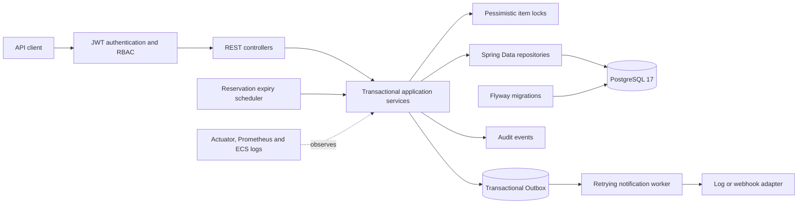
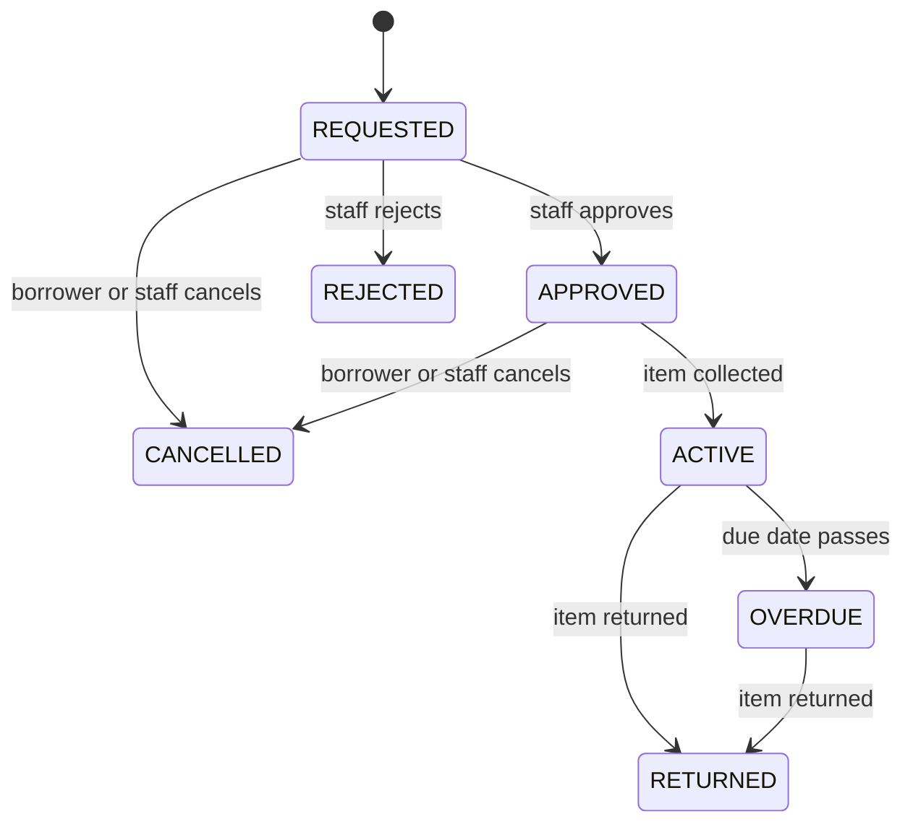

# Resource Lending API

[](https://github.com/ricardoportoIE/resource-lending-api/actions/workflows/ci.yml)


A production-oriented REST API for lending shared organisational resources: books, laptops, rooms, tools and other individually tracked assets. It handles catalogue inventory, policy-driven loans, FIFO reservations and simultaneous claims without lending the same physical item twice.

This repository is also a modernization case study. An academic library CRUD application was incrementally rebuilt into a secure, observable and containerised Java 21 service while preserving its Git history and archiving the superseded schema without destroying data.

## Engineering highlights

- Explicit loan state machine instead of a generic status update.
- Pessimistic row locking plus partial unique indexes for last-item concurrency safety.
- FIFO reservation queue with ready windows, expiry and automatic promotion on return.
- Short-lived JWT access tokens and opaque, hashed, rotating refresh tokens with reuse detection.
- `STUDENT`, `STAFF` and `ADMIN` authorization at both HTTP and service boundaries.
- Policy-driven due dates and active-loan limits by role and resource type.
- Transactional, immutable audit events for domain transitions.
- Transactional Outbox notifications with idempotent delivery, retries and exponential backoff.
- RFC 9457 Problem Details with stable error codes and correlation IDs.
- Flyway-only PostgreSQL schema management with Hibernate validation.
- Testcontainers integration and concurrency tests against PostgreSQL 17.
- ECS-compatible JSON logs, Actuator probes and Prometheus metrics.
- Multi-stage non-root image, health-checked Docker Compose and GitHub Actions CI.
- JaCoCo coverage gates and Spotless formatting enforcement.

## Architecture at a glance



The code is a feature-oriented modular monolith under `com.ricardoporto.lending`. Controllers depend on application services, services own transaction boundaries, repositories remain internal and JPA entities never cross the HTTP boundary.

Detailed, code-aligned diagrams are in [Architecture and domain flows](docs/architecture.md). Design trade-offs are recorded in [Architecture Decision Records](docs/adr/).

## Loan lifecycle



Every transition has a dedicated command endpoint. Invalid transitions return HTTP `409` with a stable code instead of silently changing state.

## Run with Docker

Requirements: Docker Desktop or another Docker-compatible engine.

```bash
cp .env.example .env
```

PowerShell:

```powershell
Copy-Item .env.example .env
```

Replace the three required placeholders in `.env` (`DB_USERNAME`, `DB_PASSWORD` and `JWT_SECRET`), then start the complete stack:

```bash
docker compose up --build
```

The database is started first and must pass its health check before the API starts. Flyway builds the schema automatically. The Java process runs as the unprivileged `app` user.

| URL | Purpose | Access |
|---|---|---|
| `http://localhost:8080/swagger-ui/index.html` | Interactive API documentation | Public |
| `http://localhost:8080/v3/api-docs` | OpenAPI JSON | Public |
| `http://localhost:8080/actuator/health` | Liveness and readiness | Public |
| `http://localhost:8080/actuator/prometheus` | Prometheus metrics | `ADMIN` |

Stop the stack while retaining database data:

```bash
docker compose down
```

Add `--volumes` only when you intentionally want to delete the local database volume.

## Run the verification suite

Requirements: Java 21+ and Docker.

```bash
./mvnw clean verify
```

PowerShell:

```powershell
.\mvnw.cmd clean verify
```

The build starts an isolated `postgres:17.6-alpine` Testcontainer, applies every production migration from an empty database, runs 24 tests, packages the executable JAR, checks formatting and enforces at least 75% line and 35% branch coverage. The HTML report is generated at `target/site/jacoco/index.html`.

GitHub Actions repeats verification on every push and pull request to `main`, uploads the coverage report and builds the production image.

## API surface

All business endpoints are versioned under `/api/v1`.

| Area | Endpoints |
|---|---|
| Authentication | `POST /auth/register`, `/auth/login`, `/auth/refresh`, `/auth/logout` |
| Catalogue | `GET/POST /resources`, `GET/PATCH /resources/{id}` |
| Inventory | `POST /resources/{id}/items`, `PATCH /resource-items/{id}/status` |
| Loans | `POST/GET /loans`, `GET /loans/{id}` |
| Loan commands | `POST /loans/{id}/approve`, `/reject`, `/collect`, `/return`, `/cancel` |
| Reservations | `POST /resources/{id}/reservations`, `GET /reservations`, `DELETE /reservations/{id}` |
| Outbox operations | `GET /admin/outbox-events?status=FAILED` (`ADMIN` only) |

Paginated catalogue queries support `type`, `category`, `status`, `page`, `size` and `sort` parameters. The generated OpenAPI document is the source of truth for request and response schemas.

Complete, copyable authentication and workflow requests are in [cURL examples](docs/api-examples.md).

## Authorization model

| Capability | STUDENT | STAFF | ADMIN |
|---|:---:|:---:|:---:|
| Browse resources and inventory | Yes | Yes | Yes |
| Request and read own loans | Yes | Yes | Yes |
| Read all loans | No | Yes | Yes |
| Approve, reject, collect or return loans | No | Yes | Yes |
| Cancel own requested/approved loan | Yes | Yes | Yes |
| Manage catalogue and item status | No | Yes | Yes |
| Create, list and cancel own reservations | Yes | Yes | Yes |
| List or cancel any reservation | No | Yes | Yes |
| Read protected operational endpoints | No | No | Yes |

Unauthenticated requests return `401`; authenticated callers without permission return `403`. Students cannot select another borrower when requesting a loan.

## Error contract

Failures use `application/problem+json` and RFC 9457. Clients can depend on `code` without parsing human-readable messages.

```json
{
  "type": "https://resource-lending-api.dev/problems/resource-not-found",
  "title": "Not Found",
  "status": 404,
  "detail": "Resource with identifier 97f1... was not found.",
  "instance": "/api/v1/resources/97f1...",
  "code": "RESOURCE_NOT_FOUND",
  "timestamp": "2026-09-19T00:00:00Z",
  "correlationId": "d8b1181c-..."
}
```

Every response includes `X-Correlation-ID`. A safe client-supplied ID is preserved; otherwise the API generates a UUID and includes it in structured logs and error responses. Passwords, access tokens and refresh tokens are redacted from application object logging.

## Technology

| Area | Choice |
|---|---|
| Language and framework | Java 21, Spring Boot 3.4.4 |
| HTTP and persistence | Spring Web, Spring Data JPA, Hibernate validation |
| Security | Spring Security, BCrypt, Auth0 Java JWT 4.4.0 |
| Database | PostgreSQL 17, Flyway |
| Documentation | springdoc-openapi 2.8.8, Swagger UI |
| Observability | Actuator, Micrometer Prometheus, ECS logging |
| Testing | JUnit 5, MockMvc, Testcontainers 2.0.5 |
| Quality and delivery | Maven Wrapper 3.9.9, Enforcer, Spotless, JaCoCo, Docker, GitHub Actions |

## Configuration

Runtime secrets are environment-only. `.env` is ignored by Git; the versioned `.env.example` contains placeholders.

| Variable | Required | Default / purpose |
|---|:---:|---|
| `DB_URL` | Yes outside Compose | PostgreSQL JDBC URL; Compose injects its internal URL |
| `DB_USERNAME` | Yes | PostgreSQL user |
| `DB_PASSWORD` | Yes | PostgreSQL password |
| `JWT_SECRET` | Yes | HMAC secret with at least 32 random characters |
| `CORS_ALLOWED_ORIGINS` | No | Empty means browser cross-origin access is denied |
| `RESERVATION_READY_WINDOW` | No | `P2D` |
| `RESERVATION_EXPIRY_SCAN_MS` | No | `60000` |
| `OUTBOX_POLL_MS` | No | Delivery worker interval; `5000` |
| `OUTBOX_BATCH_SIZE` | No | Events locked per worker run; `25` |
| `OUTBOX_MAX_ATTEMPTS` | No | Attempts before an event becomes `FAILED`; `5` |
| `OUTBOX_RETRY_BASE` | No | ISO-8601 exponential backoff base; `PT30S` |
| `NOTIFICATION_WEBHOOK_URL` | No | Blank uses the fake log adapter; otherwise receives JSON via POST |
| `NOTIFICATION_DUE_SOON_WINDOW` | No | Lead time for due-soon events; `PT24H` |
| `LOG_FORMAT` | No | `ecs`; use `plain` for local human-readable logs |
| `APP_PORT` | No | Host port `8080` in Docker Compose |

## Database evolution and modernization

Flyway is the only schema authority and Hibernate runs with `ddl-auto=validate`. Seven versioned migrations introduce authentication, inventory, loan policies, audit events, reservations, concurrency constraints and the transactional Outbox.

The original `Cliente`, `Exemplar` and `Emprestimo` API was retired after the replacement domain became complete. Migration V6 moves its tables into a dedicated `legacy` schema rather than dropping them, preserving historical data while keeping the active `public` schema and OpenAPI contract focused on resources, items, loans and reservations.

| Modernization stage | Result |
|---|---|
| Baseline and hygiene | Reproducible Java 21 build, externalised secrets and PostgreSQL integration tests |
| Persistence and architecture | Flyway migrations, constraints, feature modules, DTO boundaries and Problem Details |
| Identity and authorization | JWT/refresh lifecycle, role-based access and ownership checks |
| Domain redesign | Typed inventory, policy-based state machine and audit trail |
| Concurrency | FIFO reservations, expiry, row locks and database uniqueness backstops |
| Operations and delivery | OpenAPI, structured logs, metrics, Docker Compose, coverage gates and CI |
| Portfolio finish | Legacy API retirement, faithful diagrams and verified examples |
| Async integration | Transactional Outbox, due-soon jobs, idempotent notification delivery and failed-event operations |

The project now lives in the professional GitHub account [`ricardoportoIE`](https://github.com/ricardoportoIE/resource-lending-api); the repository history retains the original authorship and the complete modernization journey.

## Further reading

- [Architecture, domain model and concurrency flows](docs/architecture.md)
- [Verified cURL workflow](docs/api-examples.md)
- [Recruiter, CV and GitHub summary](docs/portfolio-summary.md)
- [ADR-001: Feature-oriented modular monolith](docs/adr/001-feature-modular-monolith.md)
- [ADR-002: Access and refresh-token lifecycle](docs/adr/002-access-and-refresh-token-lifecycle.md)
- [ADR-003: Resource and ResourceItem](docs/adr/003-resource-and-resource-item.md)
- [ADR-004: Explicit loan workflow](docs/adr/004-explicit-loan-workflow.md)
- [ADR-005: Reservations and concurrency](docs/adr/005-reservations-and-concurrency.md)

## Scope boundaries

The current MVP intentionally excludes e-mail notifications, distributed scheduling, rate limiting, cloud infrastructure and a frontend. Those are extension points, not features presented as complete. Access tokens remain valid until their short expiry after logout; refresh tokens are revoked server-side immediately.
