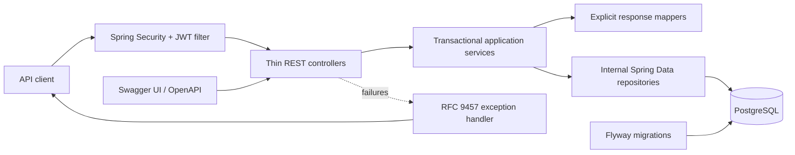

# Resource Lending API


A Java and Spring Boot REST API being re-engineered into a production-oriented platform for lending organisational resources. It currently manages library-style customers, catalogue exemplars and loans while its staged roadmap expands the domain to equipment, reservations, policies, auditability and concurrency-safe workflows.

> Originally developed as a university library management project and re-engineered as a production-oriented resource lending API, with a redesigned domain, security model, transactional workflows, database migrations, automated testing and containerised delivery.

That statement describes the target journey. Completed work and planned capabilities are deliberately separated below so the repository never presents roadmap items as shipped features.

## Why this project

Lending systems look simple until availability, authorisation and simultaneous requests meet. This project demonstrates incremental backend modernisation: secure configuration, relational consistency, explicit architecture boundaries, reproducible integration tests and, in later phases, domain state machines and concurrency control for the last available item.

## Current capabilities

- Versioned REST endpoints for customers, catalogue exemplars and loans.
- Short-lived JWT access tokens plus opaque, rotating and revocable refresh tokens.
- Persisted user registration with BCrypt hashing, duplicate-email protection and a default `STUDENT` role.
- Role-based access control for `STUDENT`, `STAFF` and `ADMIN`, with borrower ownership checks.
- Feature-oriented modular monolith under `com.ricardoporto.lending`.
- Thin controllers backed by transactional application services.
- Explicit DTO mappers; JPA entities do not cross the HTTP boundary.
- RFC 9457 Problem Details for validation, not-found, conflict and internal errors.
- PostgreSQL persistence managed by Flyway and validated by Hibernate.
- Integration, migration, security and architecture tests against PostgreSQL 17.
- Reproducible Java 21 build, Maven Wrapper and automated formatting checks.
- Runtime credentials and secrets supplied exclusively through environment variables.

## Modernisation status

| Phase | Status | Outcome |
|---|---|---|
| 0 — Audit and baseline | Complete | Legacy domain, endpoints, risks and test behaviour mapped |
| 1 — Hygiene, security and build | Complete | Java 21 baseline, externalised secrets, reproducible build, Testcontainers and formatting gate |
| 2 — PostgreSQL and Flyway | Complete | PostgreSQL, versioned migrations, constraints, indexes and schema validation |
| 3 — Architecture and error contracts | Complete | Professional package, feature modules, transactional services, DTO boundaries and RFC 9457 errors |
| 4 — Authentication and RBAC | Complete | Refresh-token lifecycle, roles, ownership and 401/403 authorization tests |
| 5–7 — Domain workflows | Next | Inventory, lending workflow, reservations and concurrency |
| 8–10 — Operations and portfolio | Planned | Observability, Docker Compose, CI and final architecture documentation |

## Architecture



```text
com.ricardoporto.lending
├── auth       registration, login and refresh-token lifecycle
├── customer   current borrower model and API
├── resource   current catalogue/exemplar model and API
├── loan       current lending model and API
├── user       identity persistence and registration
└── shared
    ├── config
    ├── exception
    └── security
```

Controllers depend only on application services. Services own transaction boundaries and coordinate repositories. Spring Data REST was removed so repositories cannot accidentally expose entities outside the documented API. A structural test protects the controller boundary.

The main decisions and trade-offs are recorded in [ADR-001: Feature-oriented modular monolith](docs/adr/001-feature-modular-monolith.md) and [ADR-002: Access and refresh-token lifecycle](docs/adr/002-access-and-refresh-token-lifecycle.md).

## Technology baseline

| Area | Technology |
|---|---|
| Language | Java 21 LTS |
| Framework | Spring Boot 3.4.4, Spring Web, Spring Data JPA |
| Security | Spring Security, BCrypt, Auth0 Java JWT 4.4.0 |
| Database | PostgreSQL 17, Flyway, Hibernate schema validation |
| API documentation | springdoc-openapi 2.8.8 |
| Testing | JUnit 5, Spring Boot Test, MockMvc, Testcontainers 2.0.5 |
| Build and quality | Maven Wrapper 3.9.9, Maven Enforcer, Spotless 3.10.2 |

## Run the tests

Requirements:

- Java 21 or newer;
- Docker Desktop or another Docker-compatible engine.

```bash
./mvnw clean verify
```

On Windows:

```powershell
.\mvnw.cmd clean verify
```

No locally installed database or database credentials are required. The command starts a pinned `postgres:17.6-alpine` container, applies production migrations and test-only fixtures, runs all 18 tests, checks formatting and packages the executable JAR.

## Run the API locally

Create a local configuration file from the safe template:

```bash
cp .env.example .env
```

PowerShell equivalent:

```powershell
Copy-Item .env.example .env
```

Replace every placeholder in `.env`, start PostgreSQL according to `DB_URL`, then run:

```bash
./mvnw spring-boot:run
```

Swagger UI is available at `http://localhost:8080/swagger-ui/index.html`.

### Environment variables

| Variable | Required | Purpose |
|---|---:|---|
| `DB_URL` | Yes | PostgreSQL JDBC URL |
| `DB_USERNAME` | Yes | Database user supplied by the runtime environment |
| `DB_PASSWORD` | Yes | Database password supplied by the runtime environment |
| `JWT_SECRET` | Yes | HMAC signing secret; use at least 32 random characters |
| `CORS_ALLOWED_ORIGINS` | No | Comma-separated browser origins; cross-origin access is denied when empty |

`.env` files are ignored by Git. Only `.env.example`, containing placeholders, is versioned.

## Database migrations

Flyway is the only source of truth for the runtime schema. The production migrations are located at:

```text
src/main/resources/db/migration/V1__initial_schema.sql
src/main/resources/db/migration/V2__authentication_and_ownership.sql
```

They create the legacy-compatible domain tables and add role reference data, customer ownership and hashed refresh-token persistence with the required keys, constraints and indexes. Hibernate runs with `ddl-auto=validate`, so a mismatch fails startup rather than silently modifying the database.

Synthetic accounts live in `src/test/resources/db/testdata/R__test_data.sql`. That location is enabled only by the `test` profile and is never packaged as production seed data.

## API and errors

The generated contract and interactive documentation are available at:

```text
GET /v3/api-docs
GET /swagger-ui/index.html
```

Explicit controllers use the `/api/v1` prefix. Existing Portuguese route names are retained during the bounded migration and will be replaced alongside their domain models in later phases.

Errors use `application/problem+json` and follow RFC 9457. Stable `code` values let clients react without parsing human-readable text; validation failures also include a field-level `errors` map.

```json
{
  "type": "https://resource-lending-api.dev/problems/resource-not-found",
  "title": "Not Found",
  "status": 404,
  "detail": "Customer with identifier 999 was not found.",
  "instance": "/api/v1/clientes/999",
  "code": "RESOURCE_NOT_FOUND",
  "timestamp": "2026-09-19T00:00:00Z"
}
```

Unexpected exceptions are logged internally and return a generic response without exposing stack traces or internal exception messages.

### Authentication lifecycle

```text
POST /api/v1/auth/register
POST /api/v1/auth/login
POST /api/v1/auth/refresh
POST /api/v1/auth/logout
```

Login returns a 15-minute signed JWT access token and a seven-day opaque refresh token. Only the SHA-256 hash of each refresh token is stored. Refresh atomically revokes the presented token and issues a replacement under a pessimistic database lock. Reuse of an already revoked token is treated as credential theft: every active refresh token for that user is revoked. Logout is idempotent and revokes the supplied refresh token.

Because outbound e-mail is outside the current MVP, registration creates an active account immediately; the legacy fixed-token confirmation simulation was removed. A persisted verification lifecycle can be added when a real notification provider is introduced.

### Authorization matrix

| Operation | STUDENT | STAFF | ADMIN |
|---|---:|---:|---:|
| Browse the catalogue | Yes | Yes | Yes |
| Read own customer profile and loans | Yes | Yes | Yes |
| Read all customers and loans | No | Yes | Yes |
| Request a loan for own customer profile | Yes | Yes | Yes |
| Create or modify customer records | No | Yes | Yes |
| Create or modify catalogue records | No | Yes | Yes |
| Modify or delete loans | No | Yes | Yes |

URL rules reject disallowed requests before controller execution, while service-level checks protect catalogue mutations and ownership-sensitive operations. Unauthenticated requests return `401`; authenticated callers without permission return `403`, both as Problem Details.

## Build quality

`mvn verify` enforces the minimum Java and Maven versions, compiles, tests, packages the application and runs Spotless. Formatting can also be checked or applied independently:

```bash
./mvnw spotless:check
./mvnw spotless:apply
```

The executable artifact is produced at `target/resource-lending-api-0.0.1-SNAPSHOT.jar`.

## Security posture

Completed through Phase 4:

- secrets and database credentials are externalised;
- production seed accounts were removed;
- integration secrets are generated at runtime;
- repositories are internal and cannot be exposed automatically;
- registration normalises e-mail, hashes passwords and rejects duplicates;
- access and refresh tokens have separate, configurable lifetimes;
- refresh tokens support rotation, server-side revocation and reuse detection;
- `STUDENT`, `STAFF` and `ADMIN` permissions are enforced at HTTP and service boundaries;
- students can only retrieve or create loans connected to their own customer profile;
- authentication and authorization failures correctly distinguish HTTP 401 from 403;
- browser origins are allow-listed through environment configuration;
- API failures do not leak stack traces or internal exception details.

Known limitations remain visible:

- outbound e-mail verification is intentionally deferred until a real notification integration exists;
- access tokens are self-contained and remain valid until their short expiry after logout;
- the current customer, exemplar and loan models remain transitional until the domain phases.

This baseline supports continued engineering work but is not presented as production-ready.

## Roadmap highlights

1. Introduce the resource catalogue and individually lendable resource items.
2. Model explicit loan and reservation state machines with policy-driven due dates.
3. Protect the last available item with transactional locking and a reproducible concurrency test.
4. Add audit events, correlation IDs and Actuator health checks.
5. Deliver Docker Compose, GitHub Actions, JaCoCo and verified API examples.

## Repository history

The Git history and original authorship are preserved. The academic implementation remains part of the engineering story: each modernisation phase starts from measured behaviour, introduces a bounded change and verifies the result before moving forward.
