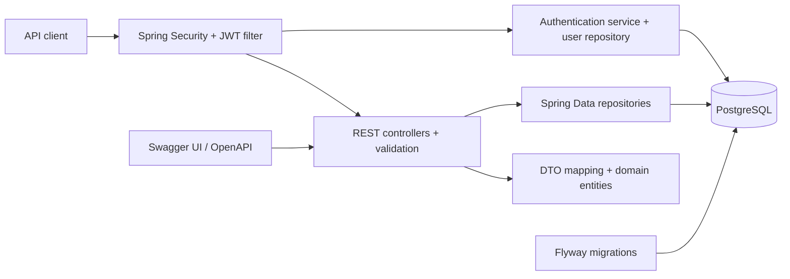

# Resource Lending API


A Java and Spring Boot REST API being re-engineered into a production-oriented platform for lending organisational resources. The project currently manages library-style clients, catalogue items and loans, while its staged roadmap expands the domain to equipment, reservations, policies, auditability and concurrency-safe workflows.

> Originally developed as a university library management project and re-engineered as a production-oriented resource lending API, with a redesigned domain, security model, transactional workflows, database migrations, automated testing and containerised delivery.

The sentence above describes the target journey. This repository reports completed work and remaining work separately so that the documentation never presents roadmap items as shipped features.

## Why this project

Lending systems look simple until availability, authorisation and simultaneous requests meet. This project is designed to demonstrate backend engineering beyond CRUD: explicit business rules, secure authentication, relational consistency, reproducible integration tests and, in later phases, concurrency control for the last available item.

## Current capabilities

- REST endpoints for clients, catalogue exemplars and loans.
- JWT-based login and stateless Spring Security filter chain.
- BCrypt password verification.
- DTO-based request and response models for the main controllers.
- Bean Validation and central exception handling.
- OpenAPI documentation with Swagger UI.
- PostgreSQL persistence through Spring Data JPA and Hibernate.
- Versioned database migrations with Flyway and `ddl-auto=validate`.
- Integration, migration and security tests against a disposable PostgreSQL 17 container.
- Reproducible Java 21 bytecode, Maven Wrapper and automated formatting checks.
- Runtime credentials and secrets supplied exclusively through environment variables.

## Modernisation status

| Phase | Status | Outcome |
|---|---|---|
| 0 — Audit and baseline | Complete | Legacy domain, endpoints, risks and test behaviour mapped |
| 1 — Hygiene, security and build | Complete | Java 21 baseline, externalised secrets, reproducible build, Testcontainers and formatting gate |
| 2 — PostgreSQL and Flyway | Complete | PostgreSQL, versioned migrations, constraints, indexes and schema validation |
| 3 — Architecture and error contracts | Next | Feature modules, thin controllers, DTO boundaries and consistent errors |
| 4–7 — Security and domain | Planned | RBAC, inventory, lending workflow, reservations and concurrency |
| 8–10 — Operations and portfolio | Planned | Observability, Docker Compose, CI and final architecture documentation |

The current code still uses the original package namespace. Renaming and reorganising it into the target modular monolith belongs to Phase 3, keeping each change reviewable.

## Architecture today



The test suite exercises the same Spring application and a real PostgreSQL engine. Testcontainers creates an isolated database for the Maven process, Flyway builds it from zero, Hibernate validates the resulting schema, and the container is removed when the process exits.

## Technology baseline

| Area | Technology |
|---|---|
| Language | Java 21 LTS |
| Framework | Spring Boot 3.4.4, Spring Web, Spring Data JPA |
| Security | Spring Security, BCrypt, Auth0 Java JWT 4.4.0 |
| Database | PostgreSQL 17, Flyway migrations, Hibernate schema validation |
| API documentation | springdoc-openapi 2.8.8 |
| Testing | JUnit 5, Spring Boot Test, MockMvc, Testcontainers 2.0.5 |
| Build and quality | Maven Wrapper 3.9.9, Maven Enforcer, Spotless 3.10.2 |

## Run the tests

Requirements:

- Java 21 or newer;
- Docker Desktop or another Docker-compatible engine running.

```bash
./mvnw clean verify
```

On Windows:

```powershell
.\mvnw.cmd clean verify
```

No locally installed database and no database credentials are required for tests. The command starts a pinned `postgres:17.6-alpine` container, applies the production migration and test-only fixtures, runs all 16 tests, checks formatting and packages the executable JAR.

## Run the API locally

Create a local configuration file from the safe template:

```bash
cp .env.example .env
```

PowerShell equivalent:

```powershell
Copy-Item .env.example .env
```

Replace every placeholder in `.env`, start a PostgreSQL instance matching `DB_URL`, and run:

```bash
./mvnw spring-boot:run
```

Swagger UI is then available at `http://localhost:8080/swagger-ui/index.html`.

### Environment variables

| Variable | Required | Purpose |
|---|---:|---|
| `DB_URL` | Yes | PostgreSQL JDBC URL |
| `DB_USERNAME` | Yes | Database user supplied by the runtime environment |
| `DB_PASSWORD` | Yes | Database password supplied by the runtime environment |
| `JWT_SECRET` | Yes | HMAC signing secret; use at least 32 random characters |
| `EMAIL_CONFIRMATION_TOKEN` | Yes | Transitional token for the legacy confirmation endpoint |

`.env` files are ignored by Git. Only `.env.example`, containing placeholders, is versioned.

## Database migrations

Flyway is the only source of truth for the runtime schema. The initial migration is located at:

```text
src/main/resources/db/migration/V1__initial_schema.sql
```

It creates the legacy-compatible domain tables together with explicit primary keys, foreign keys, uniqueness rules, checks and indexes. Hibernate runs with `ddl-auto=validate`, so a mismatch fails application startup instead of silently changing the database.

Synthetic accounts are isolated in `src/test/resources/db/testdata/R__test_data.sql`. That location is enabled only by the `test` profile and is never packaged as production seed data.

## API discovery

The application exposes its OpenAPI contract at:

```text
GET /v3/api-docs
GET /swagger-ui/index.html
```

The current API uses `/api/v1` for the explicitly implemented controllers. The generated OpenAPI document is the source of truth while the endpoint design is progressively modernised.

## Build quality

`mvn verify` enforces the minimum Java and Maven versions and runs Spotless after the tests. Formatting can also be checked or applied directly:

```bash
./mvnw spotless:check
./mvnw spotless:apply
```

The executable artifact is produced at:

```text
target/resource-lending-api-0.0.1-SNAPSHOT.jar
```

## Security posture

Completed in Phase 1:

- removed versioned database credentials and default JWT secrets;
- removed production seed accounts;
- replaced custom credential parsing with Spring Boot datasource configuration;
- generated test secrets at runtime;
- isolated integration data inside disposable containers;
- ignored local environment and secret files.

Known limitations are intentionally visible:

- refresh-token rotation, logout and revocation are not implemented yet;
- the registration and email-confirmation flows remain transitional legacy code;
- fine-grained RBAC and ownership checks require Phase 4;
- repository exposure and the legacy exception contract require the architectural refactor.

This baseline is suitable for continued engineering work, not yet for production deployment.

## Roadmap highlights

1. Reorganise the codebase as a modular monolith under `com.ricardoporto.lending`.
2. Introduce a consistent RFC 9457 error contract and clear transactional service boundaries.
3. Introduce users, roles, resource catalogue and individually lendable resource items.
4. Implement access/refresh token rotation, revocation, RBAC and ownership rules.
5. Model explicit loan and reservation state machines with policy-driven due dates.
6. Protect the last available item with transactional locking and a reproducible concurrency test.
7. Add audit events, correlation IDs and Actuator health checks.
8. Deliver Docker Compose, GitHub Actions, JaCoCo and verified API examples.

## Repository history

The Git history and original authorship are preserved. The earlier academic implementation is part of the engineering story: each modernisation phase starts from measured behaviour, introduces a bounded change and verifies the result before moving forward.
